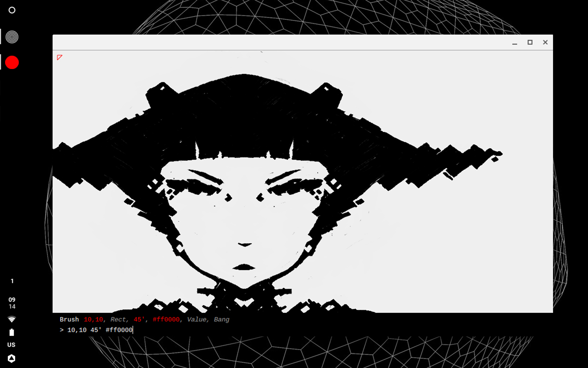

#Ronin



#Starting

Ronin is a web based drawing application and visual language. Launch index.html and press **:**(colon) to display the command prompt. Input the commands below to interface with the different tools. Headings with a star are features in development.

```
:
```

#Modules
##Canvas
```
@ 600x400                         ; New canvas of size 600w and 400h
@ 100x100 #ff0000                 ; New canvas of size 100w and 100h with red background
@ !                               ; Clear canvas
```

##Save File
```
$ new_name                        ; Create a new file with name
$ 3                               ; Save to temporary storage, accessible with Load
$ !                               ; Clear temporary storage
```

##Load File
```
/ dir/file_name.jpg 10,10 100x100 ; Load image, at 10,10 with size 100x100
/ dir/file_name.jpg 10,10 100x    ; Load image, at 10,10 with size 100w and auto height
/ 3                               ; Load temporary storage id
```

##Brush(Pointers)
```
> 10                              ; Size 10
> -4                              ; Eraser, Size 4
> 10,0                            ; Add pointer at pos
> 400x0                           ; Add mirror pointer, at 400x
> 4 #ff0000                       ; Red brush, Size 4
> 100,100 45'                     ; Radial brush from position x,y and 45 degrees
> !                               ; Remove all pointers
```

##Guides
```
| 10,10 100x100                   ; Draw a guide
| -100,0                          ; Draw a grid at every 100px
| !                               ; Remove all guides
```

##Vector(SVG)
```
+ M10 10 h 80 v 80 h -80 Z                                     ; Draw a square outline
+ M10 80 C 40 10, 65 10, 95 80 S 150 150, 180 80               ; Draw a bezier
+ M 100, 100 m -75, 0 a 75,75 0 1,0 150,0 a 75,75 0 1,0 -150,0 ; Draw a circle
```

##Stroke*
```
- 0,0 0,10 10,10 10,0 0,0         ; Draw a square
```

##Filters*
```
: saturation 0.5                  ; Set image saturation to 0.5
: chromatic 10                    ; Shifts, from center, pixels red value by 10, green by 5, blue by 0
: chromatic 8 0 16                ; Shifts, from center, pixels red value by 8, green by 0, blue by 16

: balance red 0.9 0.4 0.7         ; Set color balance red to 0.9 0.4 0.7
: balance white 0.7 0.7 0.7       ; Set color balance white to 0.7 0.7 0.7
: sharpen 0.5                     ; Sharpen image to 50%
```

##Translate*
```
^ 0,10                            ; Translate 10px vertically
^ 20,20 100x100 40,40             ; Translate a specific portion to a specific location
^ -1280x800                       ; Flip image horizontally
```

##Zoom*
```
= 75                              ; Zoom factor of 75%
= !                               ; Zoom 100%
```

#Units
```
5                                 ; value:    5
5,7                               ; position: 5x 7y
7x9                               ; rect:     7w 9h
#ff0000                           ; color:    red
0..5                              ; random:   0.0-5.0
45'                               ; degree:   45/365
rate:10                           ; variable: rate = 10
"foo"                             ; string:   foo
{40w}                             ; constant: 120px, 40% canvas width
```

#Constants
```
w                                 ; percentage of canvas width
h                                 ; percentage of canvas height
```

#Presets
##Radial Brush
```
# 8 strands
> 600,400 45';> 600,400 90';> 600,400 135';> 600,400 180';> 600,400 225';> 600,400 270';> 600,400 315'
# 6 strands
> 600,400 60';> 600,400 120';> 600,400 180';> 600,400 240';> 600,400 300'
```

##Symmetry Brush
```
# XY
> 400x 3
# Angular brushes
> 400x 1,1;> 400x 2,2;> 400x 3,3; > 1,1;> 2,2;> 3,3;
```

##Angular Brush
```
# Light
> 1,1;> 2,2;> 3,3;> 4,4
# Hard
> 2,2;> 4,4;> 6,6;> 8,8
# Symmetric Light
> 1,1 600x;> 2,2 600x;> 3,3 600x;> 4,4 600x
```
